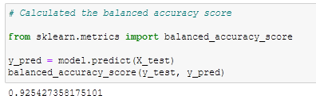
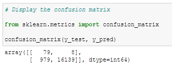
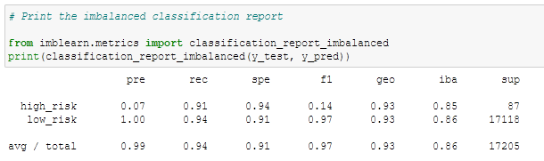

# Credit Risk Analysis

## Overview of the analysis

In order for banks to identify and prevent credit risks regarding loan applications, supervised machine learning models are developed based on historical data. The models aim to evaluate a number of "features" and determine whether it is of "high risk" or "low risk". Six models were developed using different machine learning techniques. Their performance was compared with regard to the accuracy, precision and recall.

## Results

Based on the same dataset and preprocessing methods, six models using different machine learning techniques are developed. Their performance with regard to the accuracy, precision and recall was compared as following:

| ML technique | Accuracy | Precision | Recall |
| :---: | :---: | :---: | :---: |
| Naive Random Oversampling with Logistic Regression | 0.64 | 0.0090 | 0.62 |
| SMOTE Oversampling with Logistic Regression | 0.63 | 0.0087 | 0.62 |
| Cluster Centroids with Logistic Regression | 0.51 | 0.0052 | 0.59 |
| SMOTEENN with Logistic Regression | 0.62 | 0.0078 | 0.71 |
| Balanced Random Forest Classifier | 0.79 | 0.0350 | 0.67 |
| Easy Ensemble AdaBoost Classifier | 0.93 | 0.0750 | 0.91 |
|

Example of the results taken as screenshots for the Easy Ensemble AdaBoost Classifier technique is shown in the following figures:
- Easy Ensemble AdaBoost Classifier Balanced Accuracy Score

- Easy Ensemble AdaBoost Classifier Confusion Matrix

- Easy Ensemble AdaBoost Classifier Classification Report

## Summary

Among all the six models, the Easy Ensemble AdaBoost Classifier has the best performance on all the aspects. Its overall accuracy achieved 0.93 and its recall/sensitivity for "high risk" applications achieved 0.91, which means only 9% of the "high risk" applications will be mistaken as "low risk." Therefore, it demonstrates a good protection against credit risks. Although the model's precision only achieved 0.075, which means 92.5% of applications that are classified as "high risk" might be actually "low risk", this type of errors can probably be corrected with supplemental documents to support the loan application. 

In summary, the Easy Ensemble AdaBoost Classifier model can be used to identify and prevent high risk applications.

